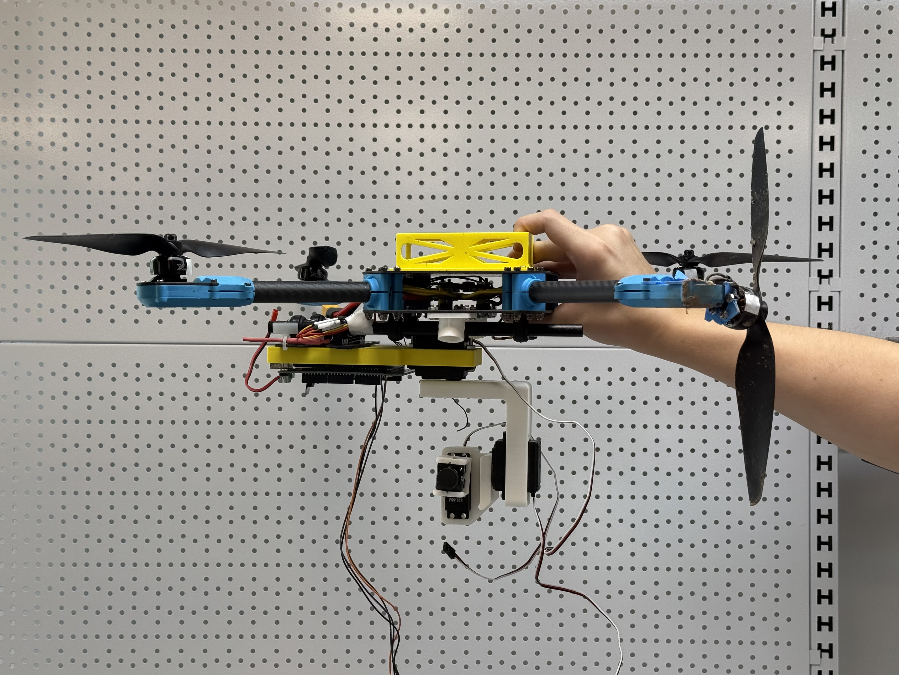
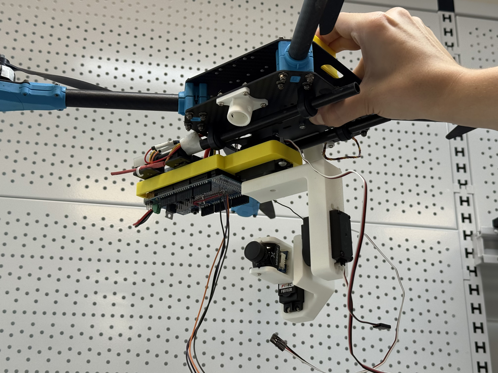
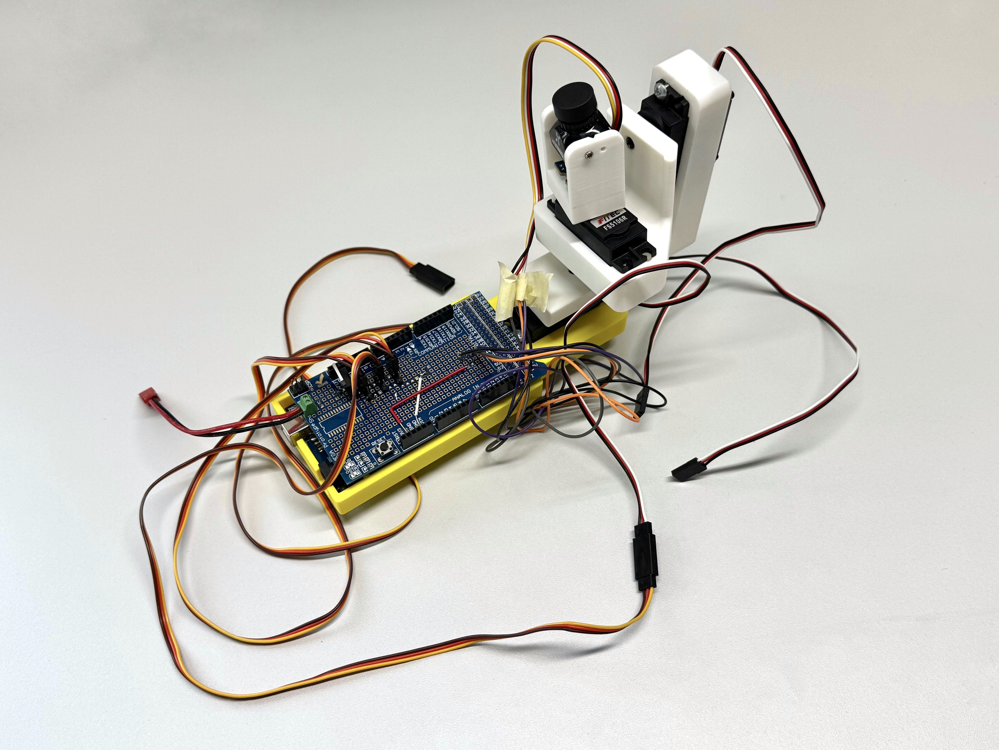
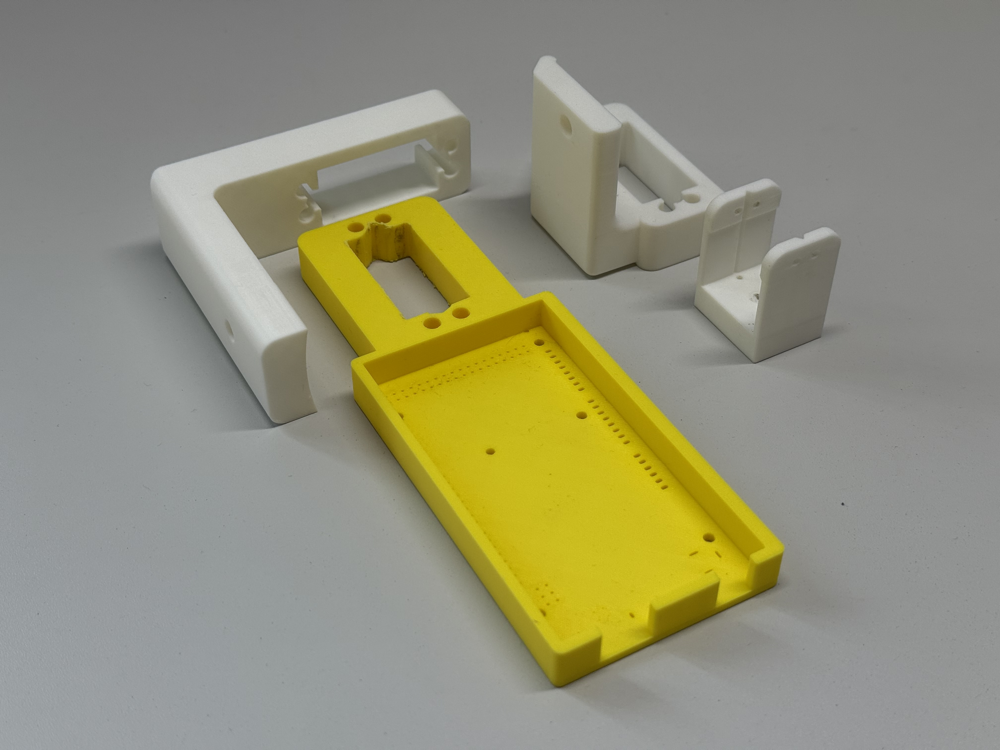

# Gimbal_3DOF

---

## 📖 Project Description

**Gimbal 3DOF** is a three-axis camera stabilization system (pitch, roll, yaw) designed for integration with drones and small aerial platforms. The goal of the project was to create a modular, lightweight, energy-efficient gimball, for the Project classes of AGH university of science and technology course , Mechatronic Design . The system uses an IMU and servos, controlled by an STM32 microcontroller in the custom PCB , and by Arduino Mega within the prototype , both running with FreeRTOS. A Python-based graphical user interface (GUI) is also provided for testing and interaction. The working model present on the provided photos is a prototype that doesnt have the custom PCB that has been designed

---

## ⚙️ Features

- 3-axis stabilization: **Pitch**, **Roll**, and **Yaw**
- Supports cameras up to **200 g**
- Compact size: **30 × 10 × 15 cm**
- Lightweight design: **~200 g**
- Power consumption: **~900 mA** estimated for worst case scenario
- UART-based communication
- Rubber-based vibration damping system
- Python GUI for testing and position control
- FreeRTOS-based multithreaded control system
- Optimized weight distribution and center of mass

---

## 🧾 Requirements

### Hardware with custom PCB

| Component           | Model / Notes                    |
|---------------------|----------------------------------|
| Microcontroller     | STM32G431CBT6                    |
| IMU Sensor          | IMU 9DOF v2.0                    |
| Servos              | Feetech FS510R ×3                |
| Oscillator          | 8 MHz WE-XTAL                    |
| PCB                 | Custom PCB or Arduino prototype  |
| Logic level shifters| 2× SN74LV1T34                    |
| Vibration dampers   | Silicone-based, hand-cut         |

### Hardware of Prototype

| Component           | Model / Notes                    |
|---------------------|----------------------------------|
| Board               | Arduino Mega                     |
| IMU Sensor          | IMU 9DOF v2.0                    |
| Servos              | Feetech FS510R ×3                |
| LM7805              | 5v Linear Stabilizator           |
| 7.4 v lipo          | a small lipo battery 2s          |

### Connection scheme for the prototype 
#### 🧭 Servo Motor Pinout

| Servo Axis | Signal Pin (Arduino) | VCC (5 V from LM7805) | GND (Common Ground) |
|------------|----------------------|------------------------|----------------------|
| Roll       | D9                   | LM7805 OUT             | LM7805 GND           |
| Pitch      | D10                  | LM7805 OUT             | LM7805 GND           |
| Yaw        | D2                   | LM7805 OUT             | LM7805 GND           |

---

### ⚡ Power Supply Setup (LM7805)

| LM7805 Pin | Connects To                                      |
|------------|--------------------------------------------------|
| **IN**     | 7.4 V battery (+)                                |
| **OUT**    | - 5 V to all Servo VCC pins    - 5 V to Arduino **VIN** *(optional)* |
| **GND**    | - Battery (–)   - All Servo GND pins   - Arduino **GND** |

The connection from 5v to vin is optional since the power to arduino is also delivered via cable that sends the commands to arduino 

### Software

- FreeRTOS (embedded)
- Python GUI for control and testing
- Source code (C / Arduino)

---

## 💻 Usage

1. Connect all components using the provided PCB or wire manually according to the schematic.
2. Upload the firmware from the `Arduino_example\GimbalControl1` directory to the Arduino.
3. Launch the GUI from the `python_gui` directory for testing and IMU visualization.
4. The gimbal continuously reads IMU data and stabilizes the camera accordingly.
5. You can also send specific positions for the gimbal to hold using the GUI.

---

## 🧩 Hardware & Software

**Hardware:**
- FS510R servos provide accurate positioning with low power consumption.
- IMU 9DOF v2.0 offers compact size, low power, and acceptable precision.
- Custom PCB integrates all components for clean wiring and scalability.
- Silicone dampers mitigate mechanical vibrations from drone operation.

**Software:**
- Based on FreeRTOS – enables independent control of each axis.
- Python GUI allows sending positions, reading IMU data, and system testing.
- All code is available in the `Arduino_example` and `python_gui` directories.

---

## 📈  Simulations

The project included modal simulations (FEM) using Siemens NX. These simulations helped with:

- Identifying modal frequencies (especially around **700 Hz**) and ensuring the control loop (**100 Hz**) avoids them.
- Optimizing the gimbal’s mass distribution and weight balancing.
- Evaluating dynamic response under two critical configurations (extreme pitch/yaw).

Simulation results guided mechanical redesigns and ensured robustness in real-world operation.

---

## 🖼️ Prototype Images

### ✅ Final prototype mounted on a drone:

### 🛠️ Printed components:

### 🖥️ GUI for testing and visualization:

## FEM Analisys
FEM analysis of the mechatronic system was performed. Specifically, the mode vibration analysis using Siemens NX software. The system was analyzed in two configurations. Bellow we list a few illustrations showing NX environment:

.png)
---
