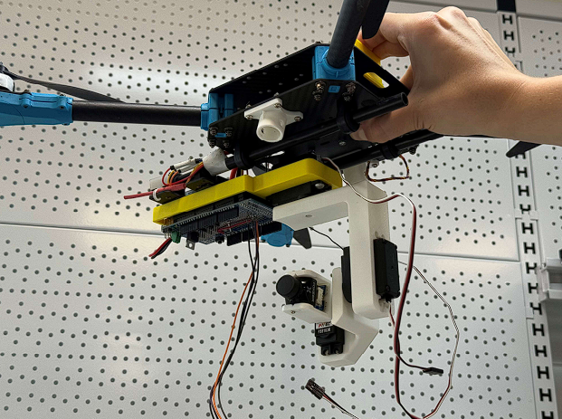
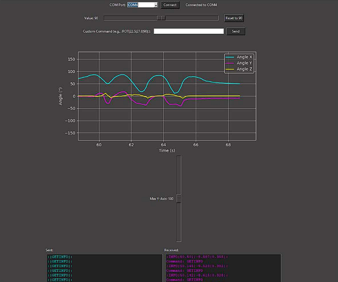

# Gimbal_3DOF

---

## 📖 Opis projektu

**Gimbal 3DOF** to trójosiowy system stabilizacji kamery (pitch, roll, yaw) zaprojektowany z myślą o integracji z dronami i lekkimi platformami lotniczymi. Celem projektu było stworzenie modułowego, lekkiego, energooszczędnego i odpornego na warunki zewnętrzne rozwiązania dostępnego dla hobbystów oraz profesjonalistów. System opiera się na serwomechanizmach oraz czujniku IMU, a jego sterowanie realizowane jest za pomocą mikrokontrolera STM32 i systemu FreeRTOS. Interakcja z gimbalem możliwa jest również poprzez graficzny interfejs użytkownika (GUI) napisany w Pythonie.

---

## ⚙️ Funkcje

- Stabilizacja kamery w trzech osiach: **Pitch**, **Roll**, **Yaw**
- Obsługa kamer o masie do **200 g**
- Kompaktowe wymiary: **30 × 10 × 15 cm**
- Niska masa własna: **~200 g**
- Zasilanie: **900 mA**
- Komunikacja z mikrokontrolerem przez **UART**
- System tłumienia drgań z silikonowymi amortyzatorami
- GUI w Pythonie do testów i zadawania pozycji
- System oparty o **FreeRTOS** z obsługą wątków
- Zoptymalizowany środek ciężkości i rozmieszczenie masy

---

## 🧾 Wymagania

### Sprzęt

| Komponent           | Model / Uwagi                   |
|---------------------|----------------------------------|
| Mikrokontroler      | STM32G431CBT6                    |
| Czujnik IMU         | IMU 9DOF v2.0                    |
| Serwomechanizmy     | Feetech FS510R (3 sztuki)        |
| Oscylator           | 8 MHz WE-XTAL                    |
| PCB                 | Własny projekt (lub Arduino prototypowo) |
| Przetworniki logiki | 2× SN74LV1T34                    |
| Amortyzatory        | Silikonowe, ręcznie wycinane     |

### Oprogramowanie

- FreeRTOS (na mikrokontrolerze)
- GUI w Pythonie (obsługa przez UART)
- Kod źródłowy w C / Arduino IDE

---

## 💻 Użytkowanie

1. Podłącz komponenty zgodnie ze schematem lub płytką PCB.
2. Wgraj kod z katalogu `Arduino_example` do STM32/Arduino.
3. Uruchom GUI z folderu `python_gui` do testów i monitorowania IMU.
4. Gimbal automatycznie stabilizuje kamerę poprzez ciągłe porównanie pozycji z IMU.
5. Możesz zadawać konkretne pozycje do utrzymania za pomocą GUI.

---

## 🧩 Hardware & Software

**Hardware:**
- Serwomechanizmy FS510R zapewniają płynną pracę z dobrą rozdzielczością kątową.
- Czujnik IMU 9DOF v2.0 – niski pobór mocy, kompaktowy rozmiar.
- Custom PCB – umożliwia integrację wszystkich komponentów i upraszcza montaż.
- Silikonowe tłumiki redukują wpływ drgań mechanicznych z ramy drona.

**Software:**
- Oprogramowanie oparte o FreeRTOS – niezależna obsługa każdej osi.
- GUI w Pythonie umożliwia zadawanie pozycji, podgląd danych z IMU, testy i kalibrację.
- Kod źródłowy udostępniony w repozytorium (`Arduino_example` + `python_gui`).

---

## 📈 Symulacje w MATLABie

W ramach projektu przeprowadzono symulacje modalne (FEM) w środowisku Siemens NX oraz analizę drgań i częstotliwości własnych konstrukcji. Wyniki te zostały następnie użyte do:

- Weryfikacji odległości częstotliwości sterowania (100 Hz) od rezonansów (ok. 700 Hz)
- Optymalizacji rozkładu masy w celu poprawy reakcji dynamicznej
- Analizy zachowania gimbala w dwóch konfiguracjach krytycznych (pitch i yaw skrajne)

Wyniki posłużyły również jako podstawa do poprawy konstrukcji fizycznej i mechanicznej.

---

## 🖼️ Zdjęcia prototypu

### ✅ Prototyp zmontowany na dronie:

### 🛠️ Elementy konstrukcyjne:

### 🖥️ GUI do sterowania:

> Wszystkie zdjęcia znajdują się w folderze `images/`. Upewnij się, że są poprawnie dołączone w repozytorium.

---
